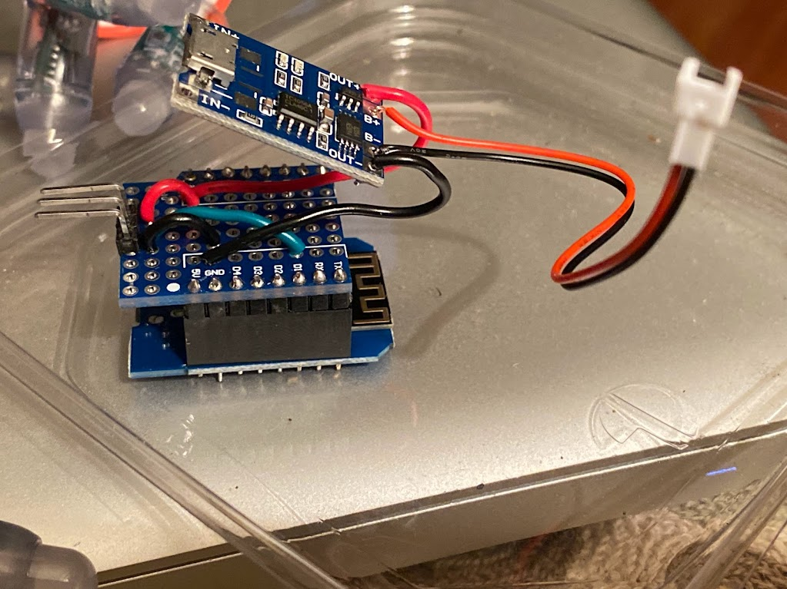
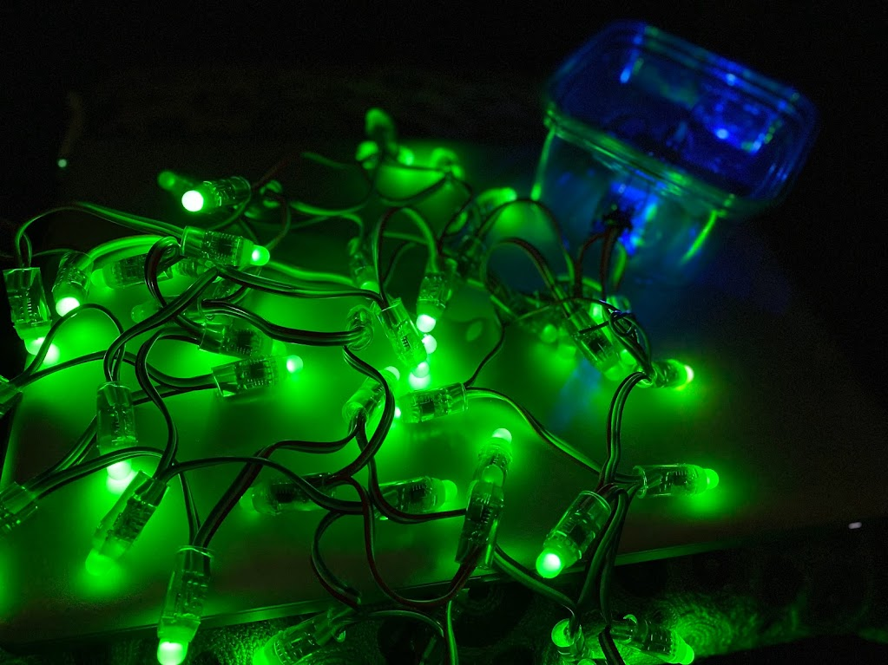

# Halloween OTA
Built up some esp8266 D1 Mini clones with shields to connect a battery and cheap WS2811 indivudally addressable LED strips. Put them in old semi-waterproof food containers and out in the yard spooky lighting during trick-or-treat night. Wrapper for over-the-air updates to wrap some slightly tweaked FastLED examples.

